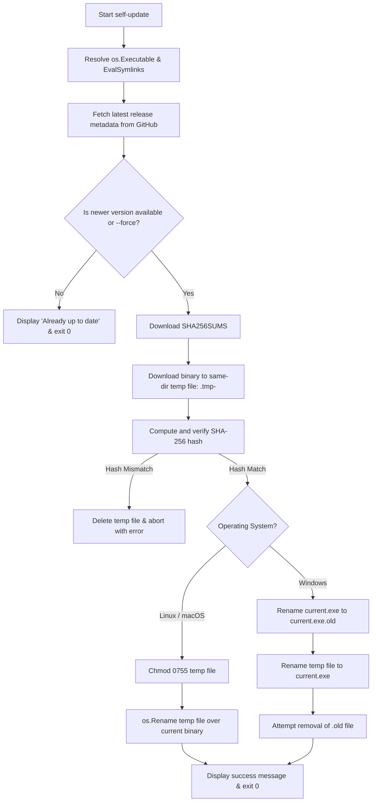

# ADR-0002: Self-Update CLI Subcommand and GitHub Releases Integration

* **Status:** Proposed / Under Review
* **Deciders:** Maintainers of `prepare-commit-msg`
* **Date:** 2026-08-16
* **Technical Domain:** CLI User Experience, Binary Distribution, GitHub Releases Integration, In-Place Self-Updating, Cross-Platform File Replacement, Cryptographic Checksum Verification

---

## Context and Problem Statement

[`prepare-commit-msg`](file:///home/mac/gitrepos/prepare-commit-msg/README.md) is a single-binary Go CLI tool and Git hook that generates conventional commit messages from staged Git diffs. As a standalone binary installed on developer workstations (e.g. in `~/.local/bin`, `/usr/local/bin`, or user-specified paths), users have no automated way to discover, download, and apply new releases without manual intervention.

Developers currently have to:
1. Manually check GitHub releases for new versions.
2. Download the platform-specific binary (`prepare-commit-msg-linux-amd64`, `prepare-commit-msg-darwin-arm64`, or `prepare-commit-msg-windows-amd64.exe`).
3. Set executable permissions (`chmod +x`).
4. Overwrite the existing executable file in their `$PATH`.

To streamline maintenance and ensure developer environments stay up-to-date with the latest fast LLM providers and bug fixes, `prepare-commit-msg` requires a native `update` CLI subcommand that checks GitHub Releases, verifies cryptographic checksums, and performs an atomic in-place binary upgrade.

---

## Decision Drivers

* **Zero-Bloat & Zero External Runtime Dependencies:** Keep the application lean and fast without pulling heavy transitive archive/compression libraries.
* **Release Asset Alignment:** Seamlessly integrate with the repository's existing release artifacts (`prepare-commit-msg-linux-amd64`, `prepare-commit-msg-darwin-arm64`, `prepare-commit-msg-windows-amd64.exe`, and `SHA256SUMS`).
* **Integrity & Security:** Mandatory SHA-256 checksum verification against the official `SHA256SUMS` manifest before replacing the binary.
* **Cross-Platform Atomic Replacement:**
  * **Unix (Linux & macOS):** Atomic inode replacement via same-directory staging and `os.Rename`.
  * **Windows:** Seamless running executable replacement via two-stage rename (`.old` rollover) to circumvent Windows file locking.
* **Ergonomics & Flexibility:**
  * Standard `prepare-commit-msg update` updates to the latest release.
  * Dry-run `--check` mode to inspect available updates without modifying the system.
  * Targeted `--version <tag>` to install a specific tag (or rollback).
  * Override `--force` flag to reinstall the current version.
  * Clear guidance if permissions are denied (e.g. binary in `/usr/local/bin` needing `sudo`).
* **Testability:** High unit test coverage with mocked GitHub API endpoints (`httptest.Server`) and simulated filesystem swaps.

---

## Considered Options

1. **Option 1: Custom In-House Idiomatic Go Self-Updater (`internal/selfupdate`)** *(Chosen)*
2. **Option 2: Third-Party High-Level Updater (`creativeprojects/go-selfupdate`)**
3. **Option 3: Hybrid Primitive Updater (`minio/selfupdate` + custom GitHub client)**

---

## Decision Outcome

**Chosen Option:** **Option 1: Custom In-House Idiomatic Go Self-Updater (`internal/selfupdate`)**

### Rationale

1. **Exact Asset Topology Fit:** The repository's release pipeline (`.github/workflows/release.yml`) builds and publishes raw static binaries and a clean `SHA256SUMS` file. It does not package them in `.tar.gz` or `.zip` archives. A native updater handles this flat topology directly in under 300 lines of clean Go code without external archive extraction dependencies.
2. **Zero Dependency Overhead:** Avoids adding large transitive dependencies (`github.com/ulikunitz/xz`, `github.com/klauspost/compress`) to `go.mod`.
3. **Robust Cross-Platform Mechanics:** Directly integrates same-filesystem atomic staging and Windows `.old` swapping while matching the codebase's existing filesystem patterns in [`internal/fsutil/atomic.go`](file:///home/mac/gitrepos/prepare-commit-msg/internal/fsutil/atomic.go).
4. **Resilient GitHub API Integration:** Supports unauthenticated requests, honors `GITHUB_TOKEN` / `GH_TOKEN` for CI or enterprise rate limits, and uses clean context timeouts.

---

## Detailed Architecture and Implementation Plan

### 1. Release Asset Mapping & Platform Matrix

The updater identifies the host environment using Go's `runtime.GOOS` and `runtime.GOARCH` and maps it to the target release asset:

| `runtime.GOOS` | `runtime.GOARCH` | Target Release Asset Name | Supported Status |
| :--- | :--- | :--- | :--- |
| `linux` | `amd64` | `prepare-commit-msg-linux-amd64` | Supported |
| `darwin` | `arm64` | `prepare-commit-msg-darwin-arm64` | Supported |
| `windows` | `amd64` | `prepare-commit-msg-windows-amd64.exe` | Supported |
| *other* | *other* | — | Unsupported (prints message directing user to `go install` / source build) |

Manifest file: `SHA256SUMS` contains checksums formatted as:
```
<sha256_hash>  prepare-commit-msg-linux-amd64
<sha256_hash>  prepare-commit-msg-darwin-arm64
<sha256_hash>  prepare-commit-msg-windows-amd64.exe
```

---

### 2. Package Architecture (`internal/selfupdate`)

The feature will be encapsulated in a new internal package: `internal/selfupdate/`.

```
internal/selfupdate/
├── client.go           # GitHub Releases API client (fetching metadata, assets, SHA256SUMS)
├── semver.go           # Semantic version parsing and comparison (vX.Y.Z)
├── updater.go          # Core update coordinator (check, download, verify, apply)
├── apply_unix.go       # POSIX atomic rename implementation (//go:build !windows)
├── apply_windows.go    # Windows two-stage rename implementation (//go:build windows)
└── updater_test.go     # Exhaustive unit tests with httptest and temp files
```

#### A. Semantic Version Comparison (`internal/selfupdate/semver.go`)
* Strips leading `v` prefixes (e.g. `v4.3.2` vs `4.3.2`).
* Supports standard `Major.Minor.Patch` plus pre-release identifiers (`-rc.1`, `-dev`).
* Exposes `Compare(v1, v2 string) int` and `IsNewer(latest, current string) bool`.
* Treats unversioned or dirty dev builds (e.g., `dirty`, `dev`, `unknown`) gracefully by allowing `--force` or reporting available releases.

#### B. GitHub Client & Integrity Verification (`internal/selfupdate/client.go`)
* **Endpoint:** `GET https://api.github.com/repos/maccavelli/prepare-commit-msg/releases/latest` (or `.../releases/tags/<tag>`).
* **Headers:**
  * `Accept: application/vnd.github+json`
  * `User-Agent: prepare-commit-msg/<current_version>`
  * `Authorization: Bearer <token>` (if `GITHUB_TOKEN` or `GH_TOKEN` environment variable is set).
* **Integrity Flow:**
  1. Download `SHA256SUMS`.
  2. Parse the expected SHA-256 hex string corresponding to the target platform asset.
  3. Stream-download the binary asset into a temporary file while hashing with `crypto/sha256`.
  4. Validate computed hash vs expected hash. If mismatch, remove temporary file and return a descriptive `ChecksumMismatchError`.

#### C. Cross-Platform Atomic Binary Replacement



* **Unix Implementation (`apply_unix.go`):**
  * Temp file created in `filepath.Dir(targetExecutable)` to ensure same filesystem mount (preventing `EXDEV` / cross-device link errors).
  * Permissions set to `0755`.
  * `os.Rename(tempFile, targetExecutable)` replaces the inode atomically. Running processes holding the old inode continue uninterrupted.
* **Windows Implementation (`apply_windows.go`):**
  * Windows locks actively executing files from being overwritten or written directly.
  * Moving/renaming an open file is permitted in NTFS.
  * Rename `app.exe` $\rightarrow$ `app.exe.old`.
  * Rename `tempFile` $\rightarrow$ `app.exe`.
  * Attempt deletion of `app.exe.old` (or let it remain for cleanup on subsequent runs).
  * Rollback on error: If moving `tempFile` fails, rename `app.exe.old` back to `app.exe`.

#### D. Permission Denied Handling
* If the binary is installed in a root-owned directory (`/usr/local/bin/prepare-commit-msg` or `/usr/bin/prepare-commit-msg`), attempting to create the temporary file or rename will yield `os.ErrPermission`.
* Catch `os.ErrPermission` and output clear, helpful instructions:
  ```
  prepare-commit-msg: error: permission denied while updating /usr/local/bin/prepare-commit-msg
  prepare-commit-msg: please rerun the command with elevated permissions:
      sudo prepare-commit-msg update
  ```

---

### 3. CLI Interface and Flag Specification

The command line syntax for `update` will be integrated into [`main.go`](file:///home/mac/gitrepos/prepare-commit-msg/main.go):

```
Usage:
  prepare-commit-msg update [flags]   - check for and apply updates from GitHub

Flags:
  --check             check if an update is available without downloading or applying it
  --force             reinstall or overwrite the current binary even if already up to date
  --version string    update (or downgrade) to a specific release tag (e.g. v4.4.0)
  --yes, -y           non-interactive mode (proceed without confirmation prompts)
```

#### Terminal User Interface Output Examples

**1. Update Available & Applied Successfully:**
```
$ prepare-commit-msg update
Checking for updates from https://github.com/maccavelli/prepare-commit-msg...
New version available: v4.4.0 (current: v4.3.2)
Downloading prepare-commit-msg-linux-amd64 from release v4.4.0...
[✓] Downloaded binary (8.4 MB)
[✓] Verified SHA-256 checksum (e3b0c44298fc1c149afbf4c8996fb92427ae41e4649b934ca495991b7852b855)
[✓] Successfully updated prepare-commit-msg to v4.4.0!
```

**2. Already Up To Date:**
```
$ prepare-commit-msg update
Checking for updates from https://github.com/maccavelli/prepare-commit-msg...
prepare-commit-msg is already up to date (version v4.4.0).
```

**3. Dry-Run Check (`--check`):**
```
$ prepare-commit-msg update --check
Checking for updates from https://github.com/maccavelli/prepare-commit-msg...
An update is available:
  Current version: v4.3.2
  Latest version:  v4.4.0
  Release page:    https://github.com/maccavelli/prepare-commit-msg/releases/tag/v4.4.0
Run 'prepare-commit-msg update' to apply the update.
```

---

## Prospective Code Organization & Changes

### Files to Add:
1. [`internal/selfupdate/semver.go`](file:///home/mac/gitrepos/prepare-commit-msg/internal/selfupdate/semver.go)
2. [`internal/selfupdate/semver_test.go`](file:///home/mac/gitrepos/prepare-commit-msg/internal/selfupdate/semver_test.go)
3. [`internal/selfupdate/client.go`](file:///home/mac/gitrepos/prepare-commit-msg/internal/selfupdate/client.go)
4. [`internal/selfupdate/updater.go`](file:///home/mac/gitrepos/prepare-commit-msg/internal/selfupdate/updater.go)
5. [`internal/selfupdate/apply_unix.go`](file:///home/mac/gitrepos/prepare-commit-msg/internal/selfupdate/apply_unix.go)
6. [`internal/selfupdate/apply_windows.go`](file:///home/mac/gitrepos/prepare-commit-msg/internal/selfupdate/apply_windows.go)
7. [`internal/selfupdate/updater_test.go`](file:///home/mac/gitrepos/prepare-commit-msg/internal/selfupdate/updater_test.go)

### Files to Modify:
1. [`main.go`](file:///home/mac/gitrepos/prepare-commit-msg/main.go): Add `update` command branch in `switch args[0]`, implement `runUpdate(args []string) error`, and update `printUsage()`.
2. [`main_test.go`](file:///home/mac/gitrepos/prepare-commit-msg/main_test.go): Add CLI dispatch test cases for `update`, `update --help`, `update --check`.
3. [`README.md`](file:///home/mac/gitrepos/prepare-commit-msg/README.md): Document `prepare-commit-msg update` CLI command and flags.

---

## Quality, Testing, and Verification Strategy

1. **Unit Testing (`internal/selfupdate`):**
   * SemVer comparisons (greater than, less than, equality, `v` prefix, pre-releases, invalid inputs).
   * GitHub API parser (mocking GitHub release JSON, asset extraction, 404/rate-limit handling).
   * Checksum manifest parsing (valid checksums, missing assets in manifest, malformed lines).
   * Checksum validator (valid matching SHA-256, deliberate bit-flip corruption to verify abortion).
   * Atomic replacement (mocking target binary and verifying replacement and permission retention).
2. **CLI End-to-End Testing (`main_test.go`):**
   * Flag parsing (`--check`, `--force`, `--version`, `--yes`).
   * Dry-run `--check` mode returns 0 and prints update status without touching files.
3. **Code Quality & Linter Compliance:**
   * `gofmt -s -w .`
   * `go vet ./...`
   * `golangci-lint run -c .golangci.yml ./...`
   * `go test -v -race ./...`
